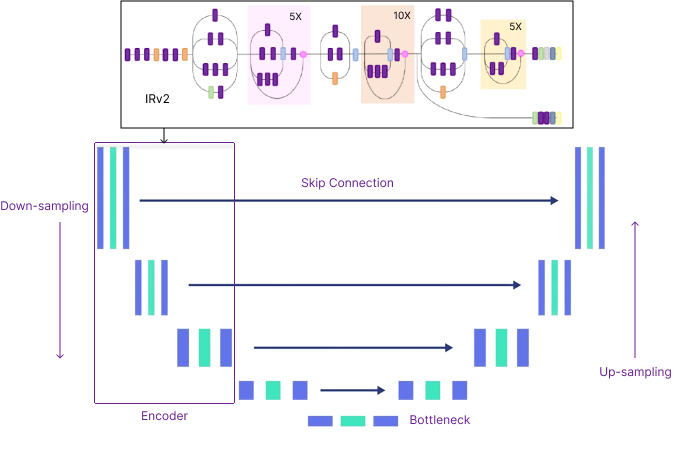
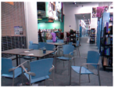
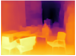

# Enhanced Encoder-Decoder Architecture for Accurate Monocular Depth Estimation 

## Overview
Monocular Depth Estimation refers to the process of predicting depth information from a single 2D image. This technique has wide applications in areas like robotics, autonomous driving, and augmented reality. It allows machines to understand the 3D structure of a scene without requiring expensive stereo cameras or depth sensors.
In this simple project, an input image is processed by a deep learning model to estimate the depth map, which encodes the relative distances of objects in the scene. Here the deep learning model is basically an encoder-decoder architecture where a pretrained model IRv2 is used as an encoder to extract feature from the image more precisely.
 The model architecture is like this: 

## Quickstart the project
1. Download the code in `ZIP` or open with `GitHub Desktop` or `https://github.com/dabbrata/Depth-Estimation-Enc-Dec.git`.
2. Then import `IRv2_Decoder_Monocular_Depth_Estimation_Full_Notebook.ipynb` file to your notebook.
3. Install required python dependencies into your python environment / virtual environment using `pip install -r Requirements.txt`.
4. Run all the cells of that imported (.ipynb) file.

## Dataset
The dataset used to train the depth estimation model taken from <a href="https://www.kaggle.com/datasets/soumikrakshit/nyu-depth-v2">here</a>.

This dataset contains 1449 densely labeled pairs of aligned RGB and depth images, 464 new scenes taken from 3 cities, 
407,024 new unlabeled frames and Each object is labeled with a class and an instance number (cup1, cup2, cup3, etc).

## Workflow
1. <b>Data preprocessing</b> :
a. Augmentation: Horizontal flipping adds variety to the training dataset and helps the model generalize better.
b. Normalization Consistency: Both RGB images and depth maps are normalized to the same scale ([0, 1]), ensuring compatibility during training.
c. Resizing: Ensures uniform dimensions for both images and depth maps, critical for batch processing in deep learning models.
d. Grayscale Conversion: Reduces depth maps to a single channel, reflecting their intrinsic nature as 2D scalar fields.

2. <b>Training depth estimation model</b> :
Transfer learning was used to train the inputs. Here, the pretrained model `Inception Resnet v2` is used as encoder for feature extraction.
After training for 15 epochs, the accuracy for three kinds of thresholds are:
a. Delta1: 89.3%
b. Delta2: 96.7%
c. Delta3: 98.5%

3. Initially, I used a basic convolutional encoder-decoder architecture for this task. While the model was simple and lightweight, the predicted depth maps lacked accuracy, especially in regions with fine details or complex textures.
To improve the accuracy, I implemented an enhanced encoder-decoder architecture with attention mechanisms and skip connections. This model significantly improved depth prediction quality, especially in areas with intricate details and varying lighting conditions. However, the computational complexity increased.
Future improvements may include optimizing the model with more fine tunning.
## Results
<!DOCTYPE html>
<html lang="en">
<head>
    <meta charset="UTF-8">
    <meta name="viewport" content="width=device-width, initial-scale=1.0">
<!--     <title>Enc-Dec-IRv2 on NYU-Depth V2</title> -->
</head>
<body>
    <table>
        <tr>
            <td>
                <h4>Enc-Dec-IRv2 on NYU-Depth V2</h4>
                <table>
                    <tr>
                        <th>Input</th>
                        <th>Output</th>
                    </tr>
                    <tr>
                        <td></td>
                        <td></td>
                    </tr>
                </table>
            </td>
            <td>
                <h4>Enc-Dec-IRv2 on KITTI</h4>
                <table>
                    <tr>
                        <th>Input</th>
                        <th>Output</th>
                    </tr>
                    <tr>
                        <td></td>
                        <td></td>
                    </tr>
                </table>
            </td>
            <td>
                <h4>Enc-Dec-IRv2 on Cityscapes</h4>
                <table>
                    <tr>
                        <th>Input</th>
                        <th>Output</th>
                    </tr>
                    <tr>
                        <td></td>
                        <td></td>
                    </tr>
                </table>
            </td>
        </tr>
    </table>
</body>
</html>

## Links and References
- Depth estimation dataset: https://www.kaggle.com/datasets/soumikrakshit/nyu-depth-v2
- Inception-Resnet-v2: https://paperswithcode.com/method/inception-resnet-v2
- Relevant Paper: https://ieeexplore.ieee.org/document/9376365

## Licensing
The code in this project is licensed under [MIT License](LICENSE).
