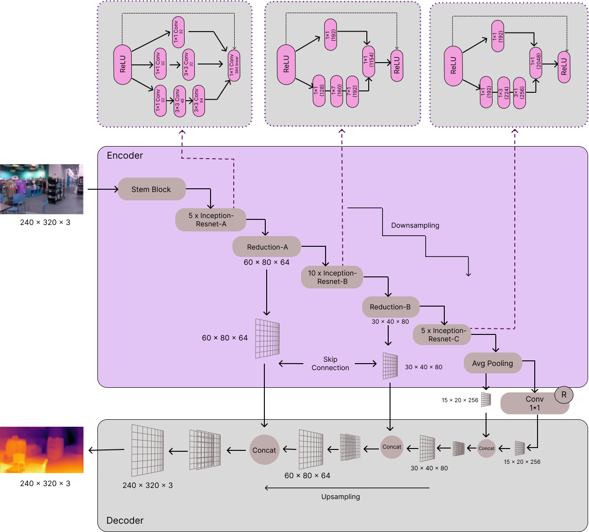
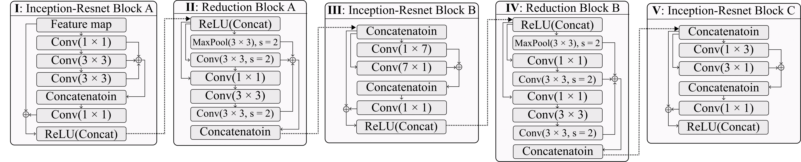
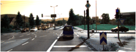
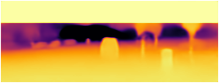
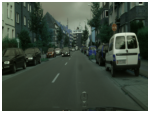
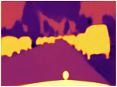

# Enhanced Encoder-Decoder Architecture for Accurate Monocular Depth Estimation 

## Overview
Monocular Depth Estimation is a technique for predicting depth information from a single 2D image, enabling the understanding of 3D scene structure without requiring expensive stereo camera systems or depth sensors. By estimating the relative distances of objects within a scene, this method finds applications in robotics, autonomous driving, augmented reality, and other domains where spatial awareness is critical.
In this project, we generate depth maps that represent the relative distances of objects in a scene from the viewpoint of the camera. These depth maps are obtained using a deep learning-based encoder-decoder architecture designed to handle the challenges of single-image depth estimation. The encoder, powered by the pretrained Inception-ResNet-v2 (IRv2) model, extracts rich and precise multi-scale features from the input image. IRv2, known for its deep network structure and ability to capture complex patterns, ensures that both local and global image features are effectively learned, leading to robust depth predictions across a wide range of object scales and scene variations.
The decoder further processes these features to generate the final depth map. It integrates the multi-scale features extracted by the encoder to reconstruct a high-resolution depth representation, capturing both the global context of the scene and intricate details such as object boundaries and fine textures. Additionally, the model achieves an efficient inference time, making it well-suited for real-time applications where speed is crucial.
<br/>The model architecture is like this:<br/>
#### Enc-Dec-IRv2 Architecture:
<br/>
#### Schematic Diagram of IRv2:


## Quickstart the project
1. Download the code in `ZIP` or open with `GitHub Desktop` or `https://github.com/dabbrata/Depth-Estimation-Enc-Dec.git`.
2. Then import `IRv2_Decoder_Monocular_Depth_Estimation_Full_Notebook.ipynb` file to your notebook.
3. Install required python dependencies into your python environment / virtual environment using `pip install -r Requirements.txt`.
4. Run all the cells of that imported (.ipynb) file.

## Dataset
The dataset used to train the depth estimation model: 

#### NYU Depth V2 <a href="https://www.kaggle.com/datasets/soumikrakshit/nyu-depth-v2">Link</a>.
This dataset contains 1449 densely labeled pairs of aligned RGB and depth images, 464 new scenes taken from 3 cities, 
407,024 new unlabeled frames and Each object is labeled with a class and an instance number (cup1, cup2, cup3, etc).

#### KITTI <a href="https://www.kaggle.com/datasets/garymk/kitti-3d-object-detection-dataset">Link1</a>, <a href="https://www.kaggle.com/datasets/emadmous/kitti-sfd-train">Link2</a>.
For the application of our model on the KITTI dataset, we selected a subset of images from the entire dataset. Specifically, we utilized 7,281 images for training and an additional 200 images for testing the model's performance.

#### Cityscapes <a href="https://www.kaggle.com/datasets/andreabaccolo/cityscapes">Link</a>.
In applying our model to the Cityscapes dataset, we selected a portion of the dataset for evaluation. Specifically, 1,571 images were used for training, and 500 images were reserved for testing the model’s performance.

## Workflow
<body>
    <h4><b>1. Data preprocessing: </b></h4>
    <ul>
        <li>a. Augmentation: Horizontal flipping adds variety to the training dataset and helps the model generalize better.</li>
        <li>b. Normalization Consistency: Both RGB images and depth maps are normalized to the same scale ([0, 1]), ensuring compatibility during training.</li>
        <li>c. Resizing: Ensures uniform dimensions for both images and depth maps, critical for batch processing in deep learning models.</li>
        <li>d. Grayscale Conversion: Reduces depth maps to a single channel, reflecting their intrinsic nature as 2D scalar fields.</li>
    </ul>
</body>


 
<body>
    <h4><b>2. Training depth estimation model: </b></h4>
    <p>Transfer learning was used to train the inputs. The pretrained model <b>Inception ResNet v2</b> was used as the encoder for feature extraction on the NYU-Depth v2 dataset. After training for 15 epochs,         the accuracy for three kinds of thresholds are as follows:</p>
    <ul>
        <li><b>Delta1:</b> 89.3%</li>
        <li><b>Delta2:</b> 96.7%</li>
        <li><b>Delta3:</b> 98.5%</li>
    </ul>
    <p> The proposed model is trained on both the KITTI and Cityscapes outdoor datasets. On the KITTI dataset, our model was compared with the DINOv2 transformer model and demonstrated superior efficiency while          maintaining competitive accuracy. Specifically, the IRv2 model achieves an inference time of 0.019 seconds, making it 23 times faster than the DINOv2-S transformer model for the same input dimensions.            Although our model exhibits slightly lower accuracy compared to DINOv2-S, the trade-off in speed significantly enhances its practicality. The accuracy of DINOv2-S is as follows: </p>
    <ul>
        <li><b>Delta1:</b> 89.9%</li>
        <li><b>Delta2:</b> 97.2%</li>
        <li><b>Delta3:</b> 98.9%</li>
    </ul>
</body>

<body>
<!--     <h4><b>2. Training depth estimation model: </b></h4> -->
    <p>3. Initially, I used a basic convolutional encoder-decoder architecture for this task. While the model was simple and lightweight, the predicted depth maps lacked accuracy, especially in regions with fine     details or complex textures.
    To improve the accuracy, I implemented an enhanced encoder-decoder architecture with attention mechanisms and skip connections. This model significantly improved depth prediction quality, especially in areas     with intricate details and varying lighting conditions. However, the computational complexity increased.
    Future improvements may include optimizing the model with more fine tunning.</p>
</body>

## Results
<!DOCTYPE html>
<html lang="en">
<head>
    <meta charset="UTF-8">
    <meta name="viewport" content="width=device-width, initial-scale=1.0">
<!--     <title>Enc-Dec-IRv2 on NYU-Depth V2</title> -->
</head>
<body>
    <table>
        <tr>
            <td>
                <h4>Enc-Dec-IRv2 on NYU-Depth V2</h4>
                <table>
                    <tr>
                        <th>Input</th>
                        <th>Output</th>
                    </tr>
                    <tr>
                        <td></td>
                        <td></td>
                    </tr>
                </table>
            </td>
            <td>
                <h4>Enc-Dec-IRv2 on KITTI</h4>
                <table>
                    <tr>
                        <th>Input</th>
                        <th>Output</th>
                    </tr>
                    <tr>
                        <td></td>
                        <td></td>
                    </tr>
                </table>
            </td>
            <td>
                <h4>Enc-Dec-IRv2 on Cityscapes</h4>
                <table>
                    <tr>
                        <th>Input</th>
                        <th>Output</th>
                    </tr>
                    <tr>
                        <td></td>
                        <td></td>
                    </tr>
                </table>
            </td>
        </tr>
    </table>
</body>
</html>

https://github.com/user-attachments/assets/fb87f76a-f076-4ece-917b-eb40cfc5083d


## Links and References
- Depth estimation dataset (NYU Depth v2): https://www.kaggle.com/datasets/soumikrakshit/nyu-depth-v2
- Depth estimation dataset (KITTI): https://www.kaggle.com/datasets/garymk/kitti-3d-object-detection-dataset, https://www.kaggle.com/datasets/emadmous/kitti-sfd-train
- Depth estimation dataset (Cityscapes): https://www.kaggle.com/datasets/andreabaccolo/cityscapes
- Inception-Resnet-v2: https://paperswithcode.com/method/inception-resnet-v2
- Relevant Paper: https://ieeexplore.ieee.org/document/9376365

## Contributors
1. [Argho Deb Das](https://github.com/MrArgho)
2. [Farhan Sadaf](https://github.com/FarhanSadaf)

## Licensing
The code in this project is licensed under [MIT License](LICENSE).

## Citation

If you find this work useful, please cite it using the following BibTeX entry:

```bibtex
@misc{das2025enhancedencoderdecoderarchitectureaccurate,
      title={Enhanced Encoder-Decoder Architecture for Accurate Monocular Depth Estimation}, 
      author={Dabbrata Das and Argho Deb Das and Farhan Sadaf},
      year={2025},
      eprint={2410.11610},
      archivePrefix={arXiv},
      primaryClass={cs.CV},
      url={https://arxiv.org/abs/2410.11610}, 
}

